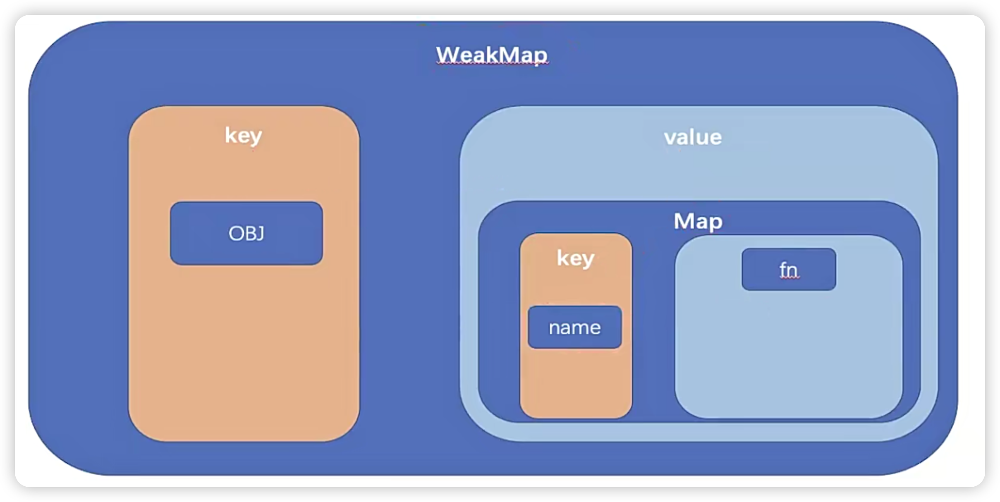

# 编程范式

- 命令式编程
- 声明式编程

# 设计原则

- 项目成本
- 开发体验

# 编译时(直接渲染 html 标签)

- render 函数将 template 中的 html 编译成 render 函数，然后再运行时通过 render 挂载对应的 dom

# 运行时(使用 js 动态生成 html 标签)

# 编译 + 运行

- 初次渲染
- 更新渲染

# 副作用

- setter 和 getter 所产生的

# 阅读源码

- 不要看边缘情况
- 更随一条主线

# 第四章

## 响应式数据

> 影响视图变化的数据

## js 的程序性

> 固定的程序流程

## definedProptype

> - 指定对象的指定 key
> - 不能监听数组或新增 obj 属性

## Proxy

> - 对整个对象进行监听

## Reflect

> - 第三个参数会改变 getter 的 this

```js
const obj = {
  a: 1,
  b: 2,
  get fullName() {
    return this.a + this.b;
  },
};
const p = new Proxy(obj, {
  get(target, key, receiver) {
    // return obj[key];
    return Reflect.get(target, key, receiver); // 3次
  },
});

console.log(p.fullName); // 应该出发三次，但是只有一次
```

## 触发依赖

## 收集依赖

## effect 是如何准确的 fn 和哪个对象的哪个属性绑定起来呢


